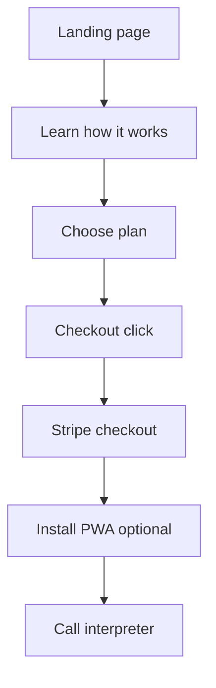

# Real Interpreter Optimization Plan

Goals: professionalism, conversion, trust, SEO rankings, and resilience for demanding users.
Audience and scope: Expats/residents and tourists in Portugal needing instant PT ↔ EN support. English-only for now.

Priorities by phase

Phase 0 quick wins 1 to 2 hours
- Fix invalid HTML extra closing section at [index.html](index.html:507)
- Consolidate meta tags into head, keep single title and description at [index.html](index.html:26-55)
- Add canonical, theme-color, og:site_name, robots at [index.html](index.html:26)
- Promote hero heading to H1 with keyword focus at [index.html](index.html:107-113)
- Clean nav anchors and footer links at [index.html](index.html:74-79,649-657)
- Update Twitter link and rel attributes at [index.html](index.html:630-646,634-638)
- Align numbers copy vs values at [index.html](index.html:172-181) and [numberTimeline](index.js:70)
- Remove Roboto import and rely on Inter Poppins at [css/index.css](css/index.css:1) and [index.html](index.html:41-46)

Phase 1 on page SEO and UX polish
- Update title to Real Interpreter PT ↔ EN phone interpreter in Portugal 24 7
- Meta description concise benefit and CTA under 160 chars
- Add How it works three steps after hero at [index.html](index.html:100)
- Add sticky Install or Get help now CTA visible on mobile and desktop
- Improve alt text width height lazy loading for non-hero images at [index.html](index.html:143-147,448-499)
- Clarify copy for airports hotels taxis emergencies in hero and features

Phase 2 conversion and trust
- Pricing badges Most popular on Standard secure Stripe badge and small guarantee at [index.html](index.html:360-433)
- Add Contact section with mailto and tel and WhatsApp anchor links at [index.html](index.html:74-79,649-657)
- Replace Blog coming soon or hide until first post exists
- Create About us section with interpreter credentials and photos at [index.html](index.html:100)
- Social proof strip with brand logos at [index.html](index.html:191-273) using [assets/images/brand-logos](assets/images/brand-logos/google.svg)

Phase 3 technical SEO
- JSON LD Organization and LocalBusiness before scripts at [index.html](index.html:662)
- JSON LD FAQPage from [index.html](index.html:510-606)
- JSON LD Product Offer for pricing cards at [index.html](index.html:360-433)
- Create [sitemap.xml](sitemap.xml:1) and [robots.txt](robots.txt:1) and submit via GSC
- Add og locale og image alt twitter site at [index.html](index.html:26-55)

Phase 4 performance
- Convert large images to WebP and compress originals under assets images home and people
- Add loading lazy decoding async to non critical images

Phase 5 accessibility
- Add nav and main landmarks skip to content link focus visible styles at [css/index.css](css/index.css:65-83) and [index.html](index.html:56-99)
- Improve mobile menu aria expanded and inert handling in [toggleHeader()](index.js:21)

Phase 6 analytics and measurement
- Configure GA4 with consent mode and basic events
- Track Stripe checkout clicks with UTM and GA4 events at [index.html](index.html:377-383,401-407,426-432)

Phase 7 PWA alignment
- Create [manifest.webmanifest](manifest.webmanifest:1) with name short name icons categories and lang en
- Register service worker [sw.js](sw.js:1) for basic offline and add link in head at [index.html](index.html:26)

Acceptance criteria per phase

Phase 0
- W3C validator shows no structural HTML errors
- One title and one meta description present and canonical tag set to https://realinterpreter.eu
- Header nav links scroll to sections and no empty hrefs remain
- H1 present above the fold with targeted keyword

Phase 1
- How it works section visible with three simple steps and CTA
- CLS under 0.1 on mobile simulated Lighthouse
- Non hero images have width and height and lazy loading

Phase 2
- Standard plan card shows Most popular badge and a security badge Stripe
- Contact section includes working mailto tel and WhatsApp links
- About us section includes interpreter name credentials and location

Phase 3
- Rich result test passes for FAQPage and Product Offer
- GSC verifies property and sitemap indexed

Phase 4
- Lighthouse performance score 90 plus on mobile target
- Total page weight under 1.2 MB on first load

Phase 5
- Keyboard navigation works menu is operable and focus ring visible
- AXE or Lighthouse accessibility score 90 plus

Phase 6
- GA4 recording page view session start and checkout click events
- UTM parameters visible in Stripe checkout URLs

Phase 7
- Lighthouse PWA installable passes manifest and service worker checks

Copy recommendations

H1 option
24 7 Portuguese ↔ English phone interpreter in Portugal

Subcopy option
Instantly get a human interpreter for banks hospitals airports hotels and taxis. Tap to call or WhatsApp. No downloads needed.

Primary CTAs
- Get help now links to tel once provided
- Install app links to https://realinterpreter.glide.page

Secondary CTAs
- See pricing anchors to [index.html](index.html:349-433)
- How it works anchors to the new section

Navigation information architecture
- Header links About Features How it works Pricing FAQ Contact
- Footer add Privacy Terms Refund Policy and social links
- Replace Blog coming soon with hidden until live or create a minimal post index

Keyword targets and on page signals
Primary keywords
- phone interpreter portugal
- portuguese to english interpreter

Secondary keywords
- english translator portugal bank hospital
- interpreter in lisbon porto algarve

Title tag template
Real Interpreter PT ↔ EN phone interpreter in Portugal 24 7

Meta description template
Instant human PT ↔ EN interpretation for banks hospitals airports hotels and taxis in Portugal. Call or WhatsApp now.

Structured data examples

Organization LocalBusiness JSON LD high level example

```json
{
  "@context": "https://schema.org",
  "@type": "LocalBusiness",
  "name": "Real Interpreter",
  "url": "https://realinterpreter.eu/",
  "image": "https://realinterpreter.eu/assets/logo.png",
  "address": {
    "@type": "PostalAddress",
    "streetAddress": "Rua do Chafariz, Escalos de Baixo",
    "addressCountry": "PT"
  },
  "areaServed": "Portugal",
  "availableLanguage": ["en", "pt"]
}
```

FAQPage JSON LD outline

```json
{
  "@context": "https://schema.org",
  "@type": "FAQPage",
  "mainEntity": []
}
```

Product Offer JSON LD outline

```json
{
  "@context": "https://schema.org",
  "@type": "Product",
  "name": "Standard Plan",
  "offers": {
    "@type": "Offer",
    "priceCurrency": "EUR",
    "price": "10",
    "availability": "https://schema.org/InStock"
  }
}
```

Tracking plan GA4

- Page view automatically via gtag config
- Event checkout_click with parameters plan basic standard pro and link_url
- Consent banner sets ad_storage and analytics_storage

Dependencies and inputs required

- Phone number for tel links and schema telephone
- WhatsApp number for wa.me links
- GA4 Measurement ID
- Decision on service area pages e.g., Lisbon Porto Algarve

Mermaid user journey



Execution approach

- Implement Phase 0 and Phase 1 first within a single PR
- Then Phase 2 trust and conversion
- Parallel small tasks sitemap robots and schema scaffolding